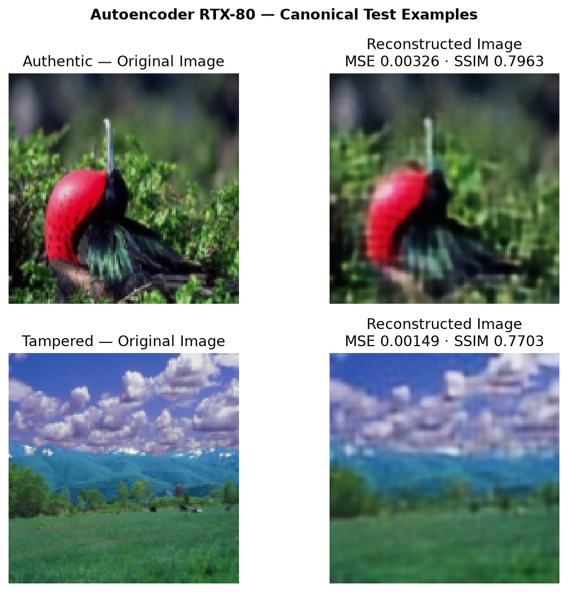
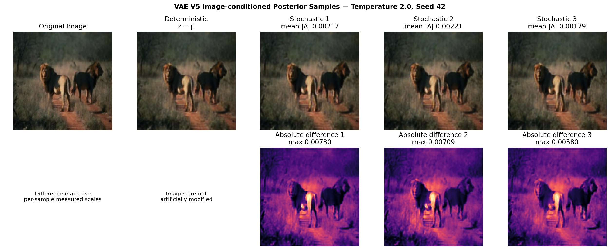
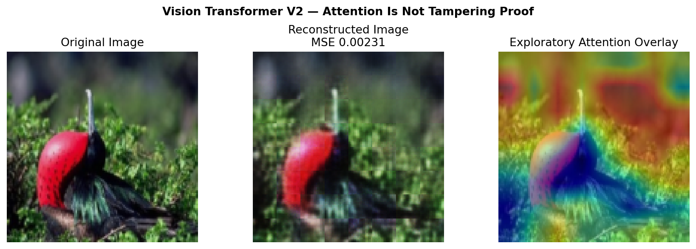
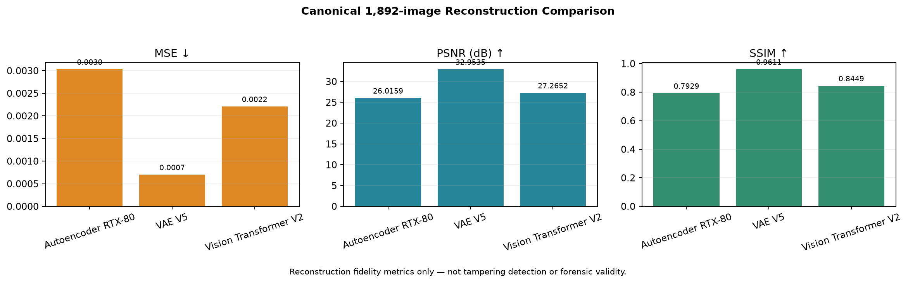

# Multi-Model Generative AI Framework for Digital Evidence Analysis and Intelligence Generation

Semester 7 Generative AI project prepared for Review 2. The repository combines three trained image architectures with a separate pretrained text Transformer integration:

1. Convolutional Autoencoder — deterministic reconstruction and compression.
2. Variational Autoencoder V5 — probabilistic latent representation, deterministic reconstruction, and image-conditioned stochastic reconstructions.
3. Vision Transformer V2 — patch-token self-attention reconstruction and exploratory attention visualization.
4. Evidence Intelligence Transformer — no-key pretrained FLAN-T5 integration for pasted text and digitally extractable PDFs.

The trained GAN implementation and checkpoints remain preserved for the later course phase but are intentionally absent from the current GUI. Diffusion is not implemented.

## Responsible-use boundary

This is an academic research prototype, not a forensic decision system. Reconstruction error is not a tampering probability. Attention is not proof or definitive localization of manipulation. Generated language may contain errors. No model output should be the sole basis for authenticity, guilt, admissibility, attribution, or another legal/forensic conclusion.

The app implements privacy-oriented controls and GDPR-oriented design principles; it does not claim formal GDPR compliance.

## Verified repository state

### Dataset and canonical split

CASIA v2.0 model inputs contain 12,614 RGB images. Ground-truth mask PNGs are excluded from model inputs.

| Split | Total | Authentic | Tampered |
| --- | ---: | ---: | ---: |
| Train | 8,830 | 5,244 | 3,586 |
| Validation | 1,892 | 1,124 | 768 |
| Test | 1,892 | 1,123 | 769 |

The manifests in `data/splits/` use repository-relative paths and seed 42. Raw CASIA data is intentionally ignored by Git.

### Same-split image reconstruction comparison

Every row below comes from the same canonical 1,892-image test manifest. Values are generated from verified JSON files by `src/build_model_comparison.py`.

| Model | MSE ↓ | PSNR ↑ | SSIM ↑ | Parameters | Epoch |
| --- | ---: | ---: | ---: | ---: | ---: |
| Autoencoder RTX-80 Final | 0.00303199 | 26.0159 dB | 0.792911 | 265,571 | 76 |
| VAE V5 Final | 0.00070007 | 32.9535 dB | 0.961139 | 17,599,971 | 79 |
| Vision Transformer V2 | 0.00220733 | 27.2652 dB | 0.844864 | 3,591,168 | 50 |

Authoritative artifacts:

- `results/image_model_comparison.json`
- `results/image_model_comparison.csv`
- `results/ae_rtx80_test_metrics.json`
- `results/vae_v5_final_test_metrics.json`
- `results/transformer_v2_test_metrics.json`
- `results/transformer_v2_test_per_image_metrics.csv`

MSE, PSNR, and SSIM measure reconstruction fidelity only. The VAE's exploratory MSE ROC-AUC is 0.5154 and the newly measured Vision Transformer MSE ROC-AUC is 0.5413, both indicating weak reconstruction-error ranking rather than validated forgery detection.

## Model details

### Autoencoder RTX-80 Final

- Input: `3 × 128 × 128`
- Latent tensor: `32 × 8 × 8` (2,048 values)
- Compression ratio: `24×`
- Parameters: 265,571
- Active checkpoint: `checkpoints/best_autoencoder_rtx80_portable.pth`
- Best checkpoint epoch: 76
- Validation MSE: 0.00305005
- Loss/role: deterministic MSE reconstruction, not classification

The GUI labels outputs as `Original Image` and `Reconstructed Image` and does not issue an authenticity verdict.



#### Quality Autoencoder candidate (not yet an active result)

`notebooks/AE/04_quality_autoencoder_training_colab.ipynb` trains a separate
quality-focused candidate from scratch. It uses residual blocks, resize-convolution
upsampling, a `32 x 16 x 16` latent tensor (6x compression), and a weighted
L1/SSIM/edge objective. It has no encoder-to-decoder skip connections. Checkpoint
selection uses validation SSIM; the canonical test split is evaluated only after
training. Do not replace the active RTX-80 checkpoint or claim an improvement until
the generated metrics and reconstruction grids have been reviewed.

### VAE V5 Final

- Input: `3 × 128 × 128`
- Latent dimension: 256, with learned `mu` and `logvar`
- Parameters: 17,599,971
- Active checkpoint: `checkpoints/VAE_V5_FINAL.pth`
- Checkpoint epoch: 79
- Reconstruction loss: `0.5 × MSE + 0.5 × L1`
- Total loss: reconstruction loss plus beta-weighted KL
- KL beta warm-up: 0.00005 to 0.00030 over 20 epochs

The Review-2 inference path encodes the uploaded image once and calculates:

```text
std = exp(0.5 × logvar)
z = mu + temperature × std × epsilon,  epsilon ~ N(0, I)
```

Every stochastic decode reuses the same image-conditioned skip tensors. Samples are seed-reproducible and are presented as probabilistic latent reconstructions—not new forensic facts. A five-image CPU smoke measurement at temperature 1.0 produced a mean absolute pixel delta of 0.001197 from the deterministic reconstruction (range 0.000259–0.003526 across 15 samples). This confirms real stochastic behavior while documenting that strong skip connections often make the visual differences subtle.

Prior-only generation is retained as a separate limitation demonstration; it can be dark/weak because the trained decoder relies heavily on encoder skips.



### Vision Transformer V2

- Input: `3 × 128 × 128`
- Patches: 64 non-overlapping `16 × 16` tokens
- Embedding dimension: 256
- Attention heads: 8
- Encoder/decoder layers: 4/2
- Feed-forward dimension: 512
- Parameters: 3,591,168
- Active checkpoint: `checkpoints/transformer_v2_final.pth`
- Checkpoint epoch: 50

`src/evaluate_transformer_v2.py` performed the full canonical evaluation. The checkpoint's 0.00206004 value remains correctly identified as validation MSE; it is not used as a test metric.



Attention shows learned patch relationships and must not be interpreted as definitive manipulation localization.

### Evidence Intelligence Transformer

The text module is separate from the trained Vision Transformer. Its flow is:

```text
TXT / digitally extractable PDF
  → validated in-memory extraction
  → token-aware chunks
  → tokenizer
  → pretrained google/flan-t5-small
  → evidence-oriented generated output
```

Features include:

- pasted UTF-8 text, `.txt`, and digitally extractable `.pdf` inputs;
- clear scanned/image-only PDF error when no digital text is found;
- six-line default analyst prompt;
- token-aware chunking with processed/truncated counts;
- configurable model through `EVIDENCE_MODEL_ID`;
- deterministic beam generation on CPU or CUDA;
- no API key for the core path; and
- a mandatory limitation/responsible-use note in every generated result.

The default model is deliberately small for CPU/Streamlit portability, so output may be terse or extractive. It is a pretrained integration, not a language model trained from scratch by the team. A real local demo output and its measured runtime metadata are stored in `docs/results/evidence_transformer_demo.md`.

## Streamlit application

The professional GUI has eight pages:

1. Project Overview
2. Autoencoder
3. Variational Autoencoder
4. Vision Transformer
5. Evidence Intelligence Transformer
6. Model Evaluation
7. Privacy & Ethical AI
8. Project Information

The three image pages support normal uploads and a reproducible 24-image canonical test selector (12 authentic and 12 tampered) when local CASIA data is available. Model loading is cached, CPU fallback is automatic, and missing files/LFS pointers produce actionable errors.

Privacy-oriented controls include:

- authorization/consent before evidence input;
- allowlisted extensions and 10 MB limits;
- Pillow/PDF content validation;
- in-memory/session processing with no automatic permanent evidence save by project code;
- explicit session evidence cleanup;
- visible model, token, truncation, and limitation information; and
- deployment guidance for HTTPS, authentication, access control, logs, region, retention, and governance.

Run from the repository root:

```powershell
streamlit run app.py
```

## Installation

Python 3.10+ is supported.

Windows PowerShell:

```powershell
python -m venv .venv
.\.venv\Scripts\Activate.ps1
python -m pip install -r requirements.txt
```

Linux/macOS:

```bash
python3 -m venv .venv
source .venv/bin/activate
python -m pip install -r requirements.txt
```

The first evidence-language-model run downloads public FLAN-T5 weights from Hugging Face unless the model is already cached. No API key is required. Set `EVIDENCE_MODEL_ID` to another local or compatible Hugging Face seq2seq model if needed.

## Checkpoints and Git LFS

`checkpoints/VAE_V5_FINAL.pth` is managed by Git LFS and is approximately 211 MB. GitHub source ZIP files may contain only a small text pointer instead of model bytes. Clone/fetch with LFS:

```powershell
git lfs install
git lfs pull --include="checkpoints/VAE_V5_FINAL.pth"
```

The active inference wrappers inspect checkpoint headers before calling `torch.load`. If a pointer is found, the error reports the expected size and exact LFS fetch command.

Checkpoint locations can be overridden without editing code:

| Environment variable | Default |
| --- | --- |
| `AE_CHECKPOINT_PATH` | `checkpoints/best_autoencoder_rtx80_portable.pth` |
| `VAE_CHECKPOINT_PATH` | `checkpoints/VAE_V5_FINAL.pth` |
| `VISION_TRANSFORMER_CHECKPOINT_PATH` | `checkpoints/transformer_v2_final.pth` |

Current local audit found real bytes for all active checkpoints. Historical AE, denoising, GAN, and VAE assets are preserved; no working checkpoint was overwritten or deleted.

## Reproducible evaluation and artifacts

From the repository root:

```powershell
python src/evaluate_autoencoder.py
python src/evaluate_vae.py
python src/evaluate_transformer_v2.py
python src/build_model_comparison.py
python src/generate_review2_artifacts.py --include-text
```

The full evaluators require the local CASIA data referenced by `data/splits/`. Selected presentation assets are committed under `docs/results/`; bulk outputs remain ignored.



## Validation

Fast local validation:

```powershell
python -m compileall -q app.py src tests
python -m unittest discover -s tests -v
```

Review-2 validation performed for this build includes:

- all source syntax compilation;
- parser/chunking/checkpoint unit tests;
- real AE, VAE, Vision Transformer, and FLAN-T5 CPU inference;
- exact canonical manifest/path/count validation;
- full 1,892-image Vision Transformer evaluation; and
- Streamlit smoke tests for every page plus real canonical-demo inference paths.

## Repository layout

```text
app.py                         Unified Streamlit interface
src/
  autoencoder.py              Final convolutional AE architecture
  vae.py                      VAE V5 architecture, loss, beta schedule
  transformer.py              Vision Transformer V2 architecture
  *_inference.py              Cached-GUI-friendly image inference
  document_parser.py          Safe TXT/PDF extraction
  evidence_transformer.py     Pretrained language Transformer wrapper
  evaluate_transformer_v2.py Canonical Vision Transformer evaluation
  build_model_comparison.py   Verified same-split comparison builder
  generate_review2_artifacts.py Reproducible selected artifacts
tests/                         Focused unit/smoke tests
data/splits/                   Fixed portable manifests
checkpoints/                   Active and preserved trained weights
results/                       Verified metrics and per-image records
docs/results/                  Small presentation-ready result set
notebooks/                     Preserved training/demo notebooks
```

## Preserved and future scope

- GAN code, notebook, checkpoints, training history, and evaluation results are preserved for the later 60-mark phase. GAN is not in the Review-2 GUI.
- Historical VAE and denoising experiments remain available but are not presented as the current final models.
- Diffusion remains future work and is not claimed as implemented.
- Cross-dataset validation, calibrated tampering classifiers, OCR for scanned PDFs, and production governance remain outside the verified Review-2 scope.
